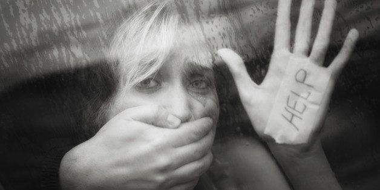
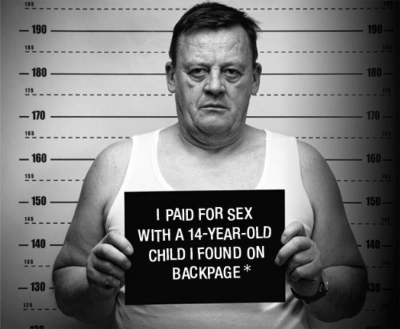
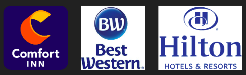
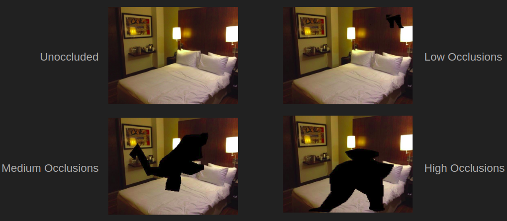
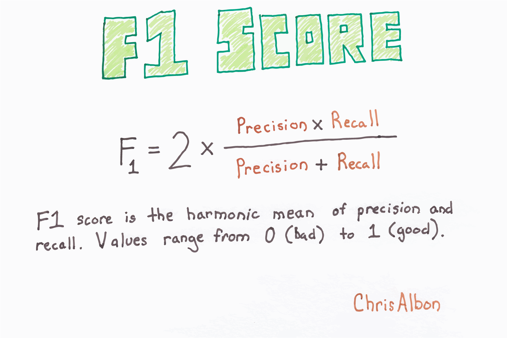
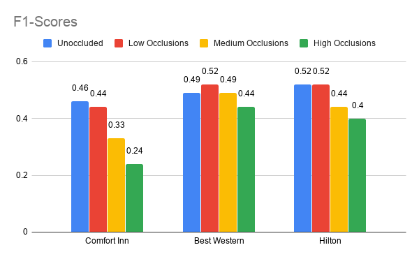
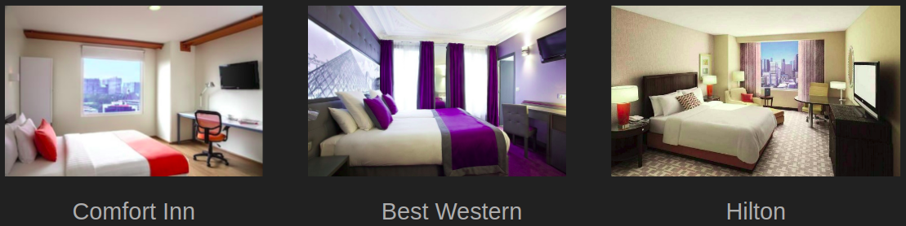
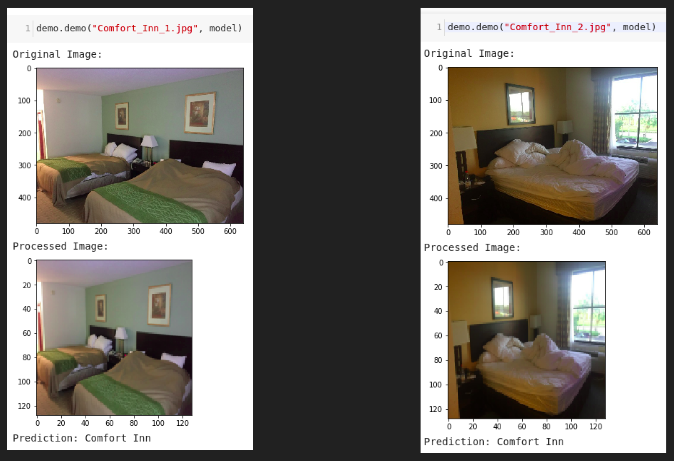
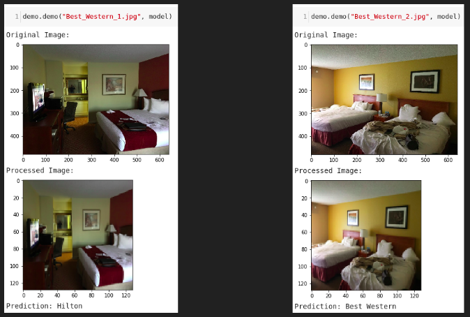
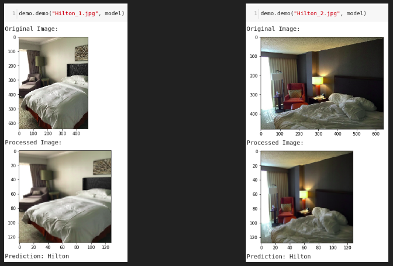

# Hotels Against Trafficking

## The Very First Step to Battling Sex Trafficking

### Motivation
 
In the United States alone:
- Approximately 75-80% of human trafficking and slavery is for sex
- 30,000 people die each year while being trafficked for sex from neglect, abuse, disease, or torture
- Nearly 20,000 victims are sold and trafficked each year. This number includes the victims who are as young as 5 and 6 years of age
- There have been approximately 100,000 to 150,000 sex slaves since 2001

Source: [The Disturbing Reality of Human Trafficking and Children](https://www.huffpost.com/entry/disturbing-reality-human-trafficking_b_8831834) (Dec 18, 2016)

--------------------------------------------------

### Objectives
**Problem**  
  
Commercial sex within hotels and motels are most frequently advertised through online platforms (Backpage.com, Eros.com, etc.) 
Source: [The National Human Trafficking Hotline](https://humantraffickinghotline.org/sex-trafficking-venuesindustries/hotelmotel-based) 

**Goal** 
Automatically classifying different hotel chains using Deep Learning

--------------------------------------------------

### Images
Images are obtained following instructions from [Hotels-50K: A Global Hotel Recognition Dataset](https://github.com/GWUvision/Hotels-50K). However, for this project, we only focus on 3 hotel chains:
- Two-star hotel chain, Comfort Inn
- Three-star hotel chain, Best Western
- Four-star hotel chain, Hilton

  

We also only use a small subset of these hotel chains' images. The training set contains 12,000 (128,128,3) images. The validation set contains 3,000 (128,128,3) images. These two sets are obtained using [sklearn's train\_test\_split](https://scikit-learn.org/stable/modules/generated/sklearn.model_selection.train_test_split.html). The "original" training set before splitted contains 5,000 (128,128,3) images of each hotel chain, totaling 15,000 (128,128,3) images.

Test images are augmented with person-shaped masks of varying size splitted into 4 categories, each contains the same:
- 388 (128,128,3) Comfort Inn images
- 384 (128,128,3) Best Western images
- 249 (128,128,3) Hilton images

An example of the 4 categories:

  

--------------------------------------------------

### Best Model & Metrics
**Best Model**  

  

- VGG-16 Deep Convolutional Neural Network pre-trained on ImageNet database
- Last 5 layers unfrozen to allow for additional training on hotel chain database

**Metrics**  

- F1-score

  

--------------------------------------------------

### Results

  

Since we have a perfectly balanced dataset with 3 classes, an F1-score of larger than 33% is better than random.

Besides Comfort Inn's Medium Occlusions case which is as good (bad) as random chance and High Occlusions case which is worse than random chance, everything else is better than random.

--------------------------------------------------

### Difficulties

  

--------------------------------------------------

### Demo

  

  

  

--------------------------------------------------

### Next Steps for Future Improvements

- Further fine-tuning the best model
- Further fine-tuning other Deep Convolutional Neural Network models

--------------------------------------------------

### Future Plans

- Automatically classifying different hotels and motels using Deep Learning

--------------------------------------------------

### Appendix:

**File Summaries:**

* data
- processed: training and test images and labels with which interested users can play around
- raw: the content structure of this folder solely serves the purpose of showing the project layout on the data side

* demo/images/
- images used for demos

* model
- this folder includes best_model.hdf5 file; since its size is larger than 100.0 MB, it cannot be pushed to GitHub

* notebooks
- build\_best_model.ipynb: details on how to build the best model
- demo.ipynb: details on how to do demos
- evaluate\_best_model.ipynb: details on how to evaluate the best model
- get\_np\_arrays\_of\_images\_and_labels.ipynb: details on how to obtain the processed data

* readme_images
- images used for README.md

* reports
- Hotels Against Trafficking.pdf: PowerPoint slide deck in pdf form
- Hotels Against Trafficking.pptx: PowerPoint slide deck

* src
- build\_best_model.py: source code to build the best model
- demo.py: source code to perform demo
- evaluate_model.py: source code to evaluate a model
- get\_np\_array\_of_images.py: source code to get a np array of images

--------------------------------------------------

### Sources
[1] https://talk1073.com/2019/08/12/no-room-for-trafficking/
[2] https://www.knkx.org/post/seattle-confronts-child-prostitution-problem-after-fbi-sweeps
[3] https://www.choicehotels.com/comfort-inn
[4] https://www.bestwestern.com/en_US.html
[5] https://www.hilton.com/en/hilton/
[6] https://gluon-cv.mxnet.io/build/examples_datasets/imagenet.html
[7] https://chrisalbon.com/machine_learning/model_evaluation/f1_score/
[8] https://keras.io/models/sequential/
[9] https://keras.io/applications/
[10] https://keras.io/callbacks/
[11] https://keras.io/layers/core/
[12] https://keras.io/layers/normalization/
[13] https://keras.io/utils/
[14] https://scikit-learn.org/stable/modules/generated/sklearn.model_selection.train_test_split.html
[15] https://scikit-learn.org/stable/modules/model_evaluation.html#classification-metrics
[16] https://pypi.org/project/opencv-python/
